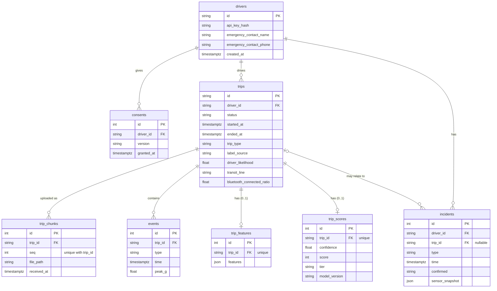

# Data model

Eight PostgreSQL tables. `backend/app/models.py` is the source of truth; this page explains it.

## Entity relationships



All timestamps are `TIMESTAMP WITH TIME ZONE` (UTC). Foreign keys have no ON DELETE
cascade; deleting a driver (`DELETE /v1/me`) removes child rows explicitly in code.

## Tables

### drivers

Purpose: a registered driver. The API key is stored only as a hash.

| Column | Type | Null | Meaning |
|---|---|---|---|
| id | string | no | Primary key, server-generated driver id. |
| api_key_hash | string | no | Hash of the driver API key (X-API-Key). |
| emergency_contact_name | string | yes | Emergency contact name. |
| emergency_contact_phone | string | yes | Emergency contact phone. |
| created_at | timestamptz | no | Registration time. |

### consents

Purpose: consent versions a driver accepted (append-only history).

| Column | Type | Null | Meaning |
|---|---|---|---|
| id | int | no | Primary key. |
| driver_id | string | no | FK to drivers.id. |
| version | string | no | Consent text version, e.g. "1.0". |
| granted_at | timestamptz | no | When consent was recorded. |

### trips

Purpose: one recorded drive, its classification and processing state.

| Column | Type | Null | Meaning |
|---|---|---|---|
| id | string | no | Primary key, server-generated trip id. |
| driver_id | string | no | FK to drivers.id. |
| status | string | no | Processing state, see Allowed values. |
| started_at | timestamptz | no | Trip start (server time at /trips/start). |
| ended_at | timestamptz | yes | Trip end; set by /end. |
| failure_reason | text | yes | Error message when status is failed. |
| trip_type | string | yes | Who was driving; null until classified. |
| label_source | string | yes | Who decided trip_type; null if unlabelled. |
| driver_likelihood | float | yes | Classifier probability 0 to 1 that the user drove. |
| transit_line | string | yes | Legacy: transit line matching was removed; always NULL. |
| bluetooth_connected_ratio | float | yes | Share 0 to 1 of the trip on car Bluetooth. |
| created_at | timestamptz | no | Row creation time. |

### trip_chunks

Purpose: index of raw sensor chunk files uploaded for a trip. Unique on (trip_id, seq).

| Column | Type | Null | Meaning |
|---|---|---|---|
| id | int | no | Primary key. |
| trip_id | string | no | FK to trips.id. |
| seq | int | no | Chunk sequence number from 0. |
| file_path | string | no | Gzipped JSON file under DATA_DIR. |
| received_at | timestamptz | no | When the chunk was stored. |

### events

Purpose: harsh driving events detected in a trip.

| Column | Type | Null | Meaning |
|---|---|---|---|
| id | int | no | Primary key. |
| trip_id | string | no | FK to trips.id. |
| type | string | no | Event kind, see Allowed values. |
| time | timestamptz | no | When the event happened. |
| peak_g | float | yes | Peak acceleration in g; null for speeding. |
| lat | float | yes | Deprecated, always NULL, dropped in migration 0005 (P3). |
| lon | float | yes | Deprecated, always NULL, dropped in migration 0005 (P3). |

### trip_features

Purpose: computed features of a trip (one row per trip, unique trip_id). The JSON shape is
`TripFeatures` in `backend/app/features.py`.

| Column | Type | Null | Meaning |
|---|---|---|---|
| id | int | no | Primary key. |
| trip_id | string | no | FK to trips.id, unique. |
| features | json | no | distance_km, duration_min, night_driving_share, events_per_100km, mean_speed_ms, max_speed_ms, speeding_time_share. No route or coordinates are stored. |
| created_at | timestamptz | no | Row creation time. |

### trip_scores

Purpose: model output for a scored trip (one row per trip, unique trip_id).

| Column | Type | Null | Meaning |
|---|---|---|---|
| id | int | no | Primary key. |
| trip_id | string | no | FK to trips.id, unique. |
| confidence | float | no | Model output 0 to 1; higher = riskier. score = 100 * (1 - confidence). |
| score | int | no | Trip score 0 to 100; higher is safer. |
| tier | string | no | Risk tier A to E derived from score. |
| model_version | string | no | Model that produced the score. |
| created_at | timestamptz | no | Row creation time. |

### incidents

Purpose: detected or reported crashes.

| Column | Type | Null | Meaning |
|---|---|---|---|
| id | int | no | Primary key. |
| driver_id | string | no | FK to drivers.id. |
| trip_id | string | yes | FK to trips.id when linked to a trip. |
| type | string | no | Incident kind; currently crash. |
| time | timestamptz | no | When it happened. |
| lat | float | yes | Deprecated, always NULL, dropped in migration 0005 (P3). |
| lon | float | yes | Deprecated, always NULL, dropped in migration 0005 (P3). |
| peak_g | float | yes | Peak acceleration in g. |
| confirmed | string | yes | Driver answer; null until confirmed. |
| sensor_snapshot | json | yes | peak_g, imu_samples, duration_ms around the crash. |
| created_at | timestamptz | no | Row creation time. |

## Indexes

Foreign-key indexes (default names `ix_<table>_<column>`), added in migration 0004:

| Index | Column |
|---|---|
| ix_trips_driver_id | trips.driver_id |
| ix_events_trip_id | events.trip_id |
| ix_incidents_driver_id | incidents.driver_id |
| ix_incidents_trip_id | incidents.trip_id |
| ix_consents_driver_id | consents.driver_id |

No extra index on `trip_chunks.trip_id` (leading column of `uq_trip_chunk`) or on
`trip_features.trip_id` / `trip_scores.trip_id` (unique).

## Allowed values

| Field | Values | Meaning / where set |
|---|---|---|
| trips.status | uploading, processing, done, failed | Trip lifecycle, see below. |
| trips.trip_type | driver, passenger, transit, unknown | classify.py sets driver/unknown (transit is only a user label or legacy value); user label sets driver/passenger. Only driver (and user-labelled unknown) trips are scored. Unknown trips unlabelled for 7 days stop counting. |
| trips.label_source | bluetooth, rules, user (or null) | bluetooth: car Bluetooth connected; rules: classifier rules; user: manual label, never overwritten. Null for unknown. Reports show null as "unlabelled". |
| events.type | harsh_brake, harsh_accel, sharp_corner, speeding | app/pipeline/events.py `_detect_events`. |
| trip_scores.tier | A, B, C, D, E | model.score_to_tier: A >= 90, B >= 75, C >= 60, D >= 40, E below 40. |
| incidents.type | crash | pipeline crash detection and POST /v1/me/incidents (free string, default crash). |
| incidents.confirmed | ok, help_needed, no_response (or null) | POST /v1/me/incidents/{id}/confirm. |
| driver summary trend | improving, stable, worsening | reports._calculate_driver_score (API only, not stored). |
| label_sources keys (insurer detail) | user, bluetooth, rules, unlabelled | Counts per label_source (API only). |
| chunk upload status | received, already_received | Response of the chunk endpoint (API only). |
| label response status | added_to_score, removed_from_score, relabelled | Response of the label endpoint (API only). |

## Trip lifecycle

```
POST /trips/start        -> uploading
POST /trips/{id}/chunks  (only while uploading)
POST /trips/{id}/end     -> processing   (background job process_trip queued)
process_trip             -> done         (scored, or classified transit/passenger and not scored)
                         -> failed       (quality check or error; failure_reason set)
POST /trips/{id}/reprocess (admin)       -> processing -> done | failed
```

- `process_trip` sets `processing` at its start, so a reprocess or a user label of
  "driver" on an unscored finished trip re-enters `processing`.
- `done` and `failed` are the final states of a run, and either can be re-run.
- Chunks are rejected unless the trip is `uploading`; `/end` also requires `uploading`.

## Where things live

- `backend/app/models.py`: database truth (tables, columns, column comments).
- `backend/app/schemas.py`: API contract (request/response models, exported to
  `backend/contract/openapi.json`).
- `backend/app/values.py`: shared allowed-value types used by both of the above.
- `backend/app/features.py`: contract with the model team (`TripFeatures`; the model input
  order is `FEATURE_ORDER` in `backend/app/model.py`).
- `backend/migrations/`: schema history (Alembic); never edit an applied revision.
